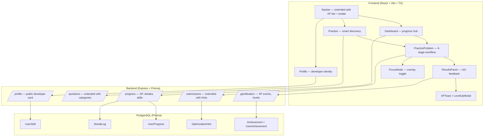
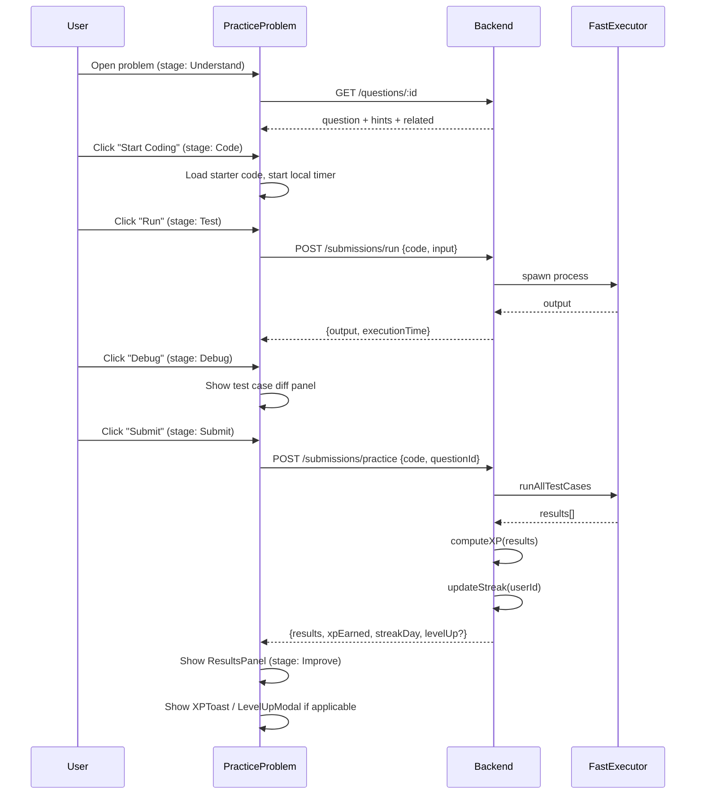
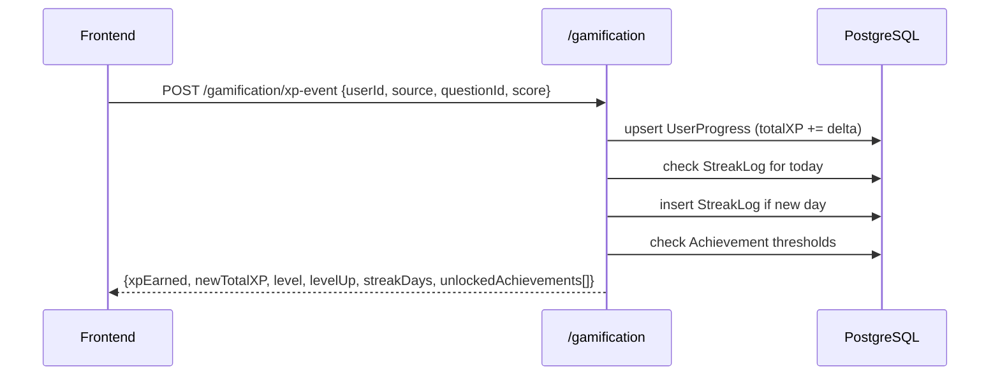

# Design Document: PRAXIS Product Flow Upgrade

## Overview

PRAXIS is being upgraded from a basic problem-solving tool into a complete developer training platform. The upgrade extends the existing React + Vite + TypeScript frontend and Express + Prisma + PostgreSQL backend without rebuilding — adding progress loops, gamification, smart discovery, a structured problem-solving workflow, and a developer identity layer (Profile page). The core philosophy is: feel like a developer tool, not a flashy website. Fast, minimal, slightly addictive through progress loops.

The upgrade touches seven surface areas: Dashboard (progress + XP), Practice list (smart discovery), Problem solver (Understand → Code → Test → Debug → Submit → Improve), Results (rich feedback), Gamification engine (XP, streaks, levels), Profile page (developer identity), and Focus Mode (distraction-free coding). Challenge Mode (secure test) is already partially built and is extended, not replaced.

All new backend data is additive — new Prisma models and columns are added alongside existing ones. All new frontend pages and components extend the existing design system (dark theme, `#73E33B` accent, CSS variables, Tailwind, AppShell, Navbar).

---

## Architecture



---

## Sequence Diagrams

### Problem Solving Workflow (6 Stages)



### XP & Streak Update Flow



---

## Components and Interfaces

### Component: Dashboard (extended)

**Purpose**: Progress hub — replaces the current minimal dashboard with XP ring, streak counter, skill radar, recent activity, and assigned tests.

**Interface**:
```typescript
interface DashboardData {
  user: { fullName: string; level: number; xp: number; xpToNextLevel: number }
  streak: { current: number; longest: number; lastActiveDate: string }
  skills: SkillSummary[]
  recentActivity: ActivityItem[]
  assignedAssessments: AssignedAssessment[]  // existing
  suggestedProblems: Question[]
}

interface SkillSummary {
  tag: string          // e.g. "arrays", "dp", "graphs"
  solvedCount: number
  avgScore: number     // 0–100
}

interface ActivityItem {
  type: 'submission' | 'achievement' | 'streak'
  questionTitle?: string
  xpEarned?: number
  timestamp: string
}
```

**Responsibilities**:
- Render XP progress ring (SVG, no external lib)
- Render streak flame counter
- Render skill tag bars (top 5 tags by solved count)
- Render recent activity feed (last 10 items)
- Preserve existing assigned tests section unchanged

---

### Component: Practice (extended)

**Purpose**: Smart problem discovery — adds category tabs, trending section, skill-gap suggestions, and solved/unsolved state per row.

**Interface**:
```typescript
interface PracticeFilters {
  difficulty: 'all' | 'easy' | 'medium' | 'hard'
  category: string | null    // maps to question tags
  search: string
  showSolved: boolean
  sortBy: 'default' | 'trending' | 'newest' | 'acceptance'
}

interface EnrichedQuestion extends Question {
  solvedByUser: boolean
  attemptCount: number
  userBestScore?: number
}
```

**Responsibilities**:
- Category tab strip (derived from all unique tags)
- Trending badge (top 10% by recent attempt count — computed backend-side)
- Solved checkmark per row (from user's submission history)
- Skill-gap row: "You haven't tried any `graphs` problems yet"

---

### Component: PracticeProblem (extended — 6-stage workflow)

**Purpose**: Structured problem-solving experience with stage awareness, Focus Mode toggle, and rich post-submit feedback.

**Interface**:
```typescript
type SolvingStage = 'understand' | 'code' | 'test' | 'debug' | 'submit' | 'improve'

interface StageConfig {
  stage: SolvingStage
  label: string
  description: string
  primaryAction: string
}

interface FocusModeState {
  active: boolean
  hideProblemPanel: boolean
  hideTopBar: boolean  // shows minimal floating timer only
}

interface DebugPanel {
  testCaseResults: TestCaseResult[]
  selectedCase: number
  diffView: boolean    // show expected vs actual side-by-side
}
```

**Responsibilities**:
- Stage indicator strip in top bar (dots or breadcrumb)
- "Understand" stage: renders problem description with estimated time, related tags, hint toggle
- "Code" stage: existing Monaco editor, language selector
- "Test" stage: run against custom input + visible test cases
- "Debug" stage: diff panel showing expected vs actual per test case
- "Submit" stage: existing submit flow + XP overlay
- "Improve" stage: post-submit panel with optimization hints, complexity analysis, "Try again" / "Next problem"
- Focus Mode: `document.body.classList.toggle('focus-mode')` — existing CSS already hides `.navbar`

---

### Component: ResultsPanel (new)

**Purpose**: Rich post-submission feedback replacing the current minimal eval overlay.

**Interface**:
```typescript
interface ResultsPanelProps {
  submission: SubmissionResult
  xpEarned: number
  levelUp: boolean
  newLevel?: number
  streakDays: number
  optimizationHints: OptimizationHint[]
  onTryAgain: () => void
  onNextProblem: () => void
  onViewProfile: () => void
}

interface OptimizationHint {
  type: 'time_complexity' | 'space_complexity' | 'style' | 'edge_case'
  message: string
  severity: 'info' | 'warn'
}
```

**Responsibilities**:
- Animated score ring (SVG, CSS animation)
- XP earned badge with `+N XP` pop animation
- Streak continuation indicator
- Per-test-case result list (existing, kept)
- Optimization hints section (collapsible)
- Action buttons: Try Again, Next Problem, View on Profile

---

### Component: XPToast (new)

**Purpose**: Lightweight floating notification for XP gains and achievements. Appears bottom-right, auto-dismisses after 3s.

**Interface**:
```typescript
interface XPToastProps {
  xpEarned: number
  achievement?: { title: string; icon: string }
  levelUp?: { newLevel: number }
}
```

---

### Component: Profile (new page)

**Purpose**: Developer identity card — public-facing summary of skills, achievements, and activity.

**Interface**:
```typescript
interface ProfileData {
  user: { fullName: string; joinedAt: string; level: number; xp: number }
  stats: { solved: number; streak: number; assessmentsPassed: number; avgScore: number }
  skills: SkillSummary[]
  achievements: UserAchievement[]
  recentSubmissions: Submission[]
}

interface UserAchievement {
  achievement: Achievement
  unlockedAt: string
}

interface Achievement {
  id: string
  title: string
  description: string
  icon: string          // emoji or SVG key
  xpReward: number
  condition: AchievementCondition
}

type AchievementCondition =
  | { type: 'problems_solved'; threshold: number }
  | { type: 'streak_days'; threshold: number }
  | { type: 'perfect_score'; count: number }
  | { type: 'level_reached'; level: number }
```

---

### Component: FocusMode (toggle utility)

**Purpose**: Distraction-free coding. Hides navbar and problem panel, shows only editor + minimal floating HUD.

**Interface**:
```typescript
// No new component needed — toggle via body class + local state in PracticeProblem
// Existing CSS: .focus-mode .navbar { display: none !important }
// New CSS needed: .focus-mode .problem-panel { display: none !important }

interface FocusHUD {
  timeLeft: number
  stage: SolvingStage
  onExitFocus: () => void
}
```

---

## Data Models

### New Prisma Models

```typescript
// UserProgress — XP, level, streak
model UserProgress {
  id            String   @id @default(uuid())
  userId        String   @unique @map("user_id")
  totalXP       Int      @default(0) @map("total_xp")
  level         Int      @default(1)
  currentStreak Int      @default(0) @map("current_streak")
  longestStreak Int      @default(0) @map("longest_streak")
  lastActiveDate DateTime? @map("last_active_date")
  updatedAt     DateTime @updatedAt @map("updated_at")
  user          User     @relation(fields: [userId], references: [id], onDelete: Cascade)
  @@map("user_progress")
}

// UserSkill — per-tag skill tracking
model UserSkill {
  id          String   @id @default(uuid())
  userId      String   @map("user_id")
  tag         String
  solvedCount Int      @default(0) @map("solved_count")
  totalScore  Int      @default(0) @map("total_score")
  updatedAt   DateTime @updatedAt @map("updated_at")
  user        User     @relation(fields: [userId], references: [id], onDelete: Cascade)
  @@unique([userId, tag])
  @@map("user_skills")
}

// Achievement definitions (seeded)
model Achievement {
  id               String            @id @default(uuid())
  title            String
  description      String
  icon             String
  xpReward         Int               @default(0) @map("xp_reward")
  conditionType    String            @map("condition_type")
  conditionValue   Int               @map("condition_value")
  userAchievements UserAchievement[]
  @@map("achievements")
}

// UserAchievement — junction
model UserAchievement {
  id            String      @id @default(uuid())
  userId        String      @map("user_id")
  achievementId String      @map("achievement_id")
  unlockedAt    DateTime    @default(now()) @map("unlocked_at")
  user          User        @relation(fields: [userId], references: [id], onDelete: Cascade)
  achievement   Achievement @relation(fields: [achievementId], references: [id])
  @@unique([userId, achievementId])
  @@map("user_achievements")
}
```

### XP Formula

```typescript
// XP awarded per practice submission
function computeXP(passedTests: number, totalTests: number, difficulty: Difficulty, isFirstSolve: boolean): number {
  const BASE: Record<Difficulty, number> = { easy: 20, medium: 50, hard: 100 }
  const ratio = totalTests > 0 ? passedTests / totalTests : 0
  const base = BASE[difficulty]
  const earned = Math.round(base * ratio)
  const firstSolveBonus = isFirstSolve && ratio === 1 ? Math.round(base * 0.5) : 0
  return earned + firstSolveBonus
}

// Level thresholds (cumulative XP)
const LEVEL_THRESHOLDS = [0, 100, 250, 500, 900, 1400, 2100, 3000, 4200, 5700, 7500]
// Level 1 = 0 XP, Level 2 = 100 XP, ..., Level 11+ = 7500+ XP

function getLevel(totalXP: number): number {
  let level = 1
  for (let i = 0; i < LEVEL_THRESHOLDS.length; i++) {
    if (totalXP >= LEVEL_THRESHOLDS[i]) level = i + 1
  }
  return level
}
```

### Streak Logic

```typescript
// Called after every successful practice submission
function updateStreak(lastActiveDate: Date | null, currentStreak: number, longestStreak: number): {
  newStreak: number
  newLongest: number
  newLastActiveDate: Date
} {
  const today = new Date()
  today.setHours(0, 0, 0, 0)

  if (!lastActiveDate) {
    return { newStreak: 1, newLongest: Math.max(1, longestStreak), newLastActiveDate: today }
  }

  const last = new Date(lastActiveDate)
  last.setHours(0, 0, 0, 0)
  const diffDays = Math.round((today.getTime() - last.getTime()) / 86400000)

  if (diffDays === 0) {
    // Already active today — no change
    return { newStreak: currentStreak, newLongest: longestStreak, newLastActiveDate: last }
  } else if (diffDays === 1) {
    // Consecutive day
    const newStreak = currentStreak + 1
    return { newStreak, newLongest: Math.max(newStreak, longestStreak), newLastActiveDate: today }
  } else {
    // Streak broken
    return { newStreak: 1, newLongest: longestStreak, newLastActiveDate: today }
  }
}
```

---

## Key Functions with Formal Specifications

### Backend: `POST /submissions/practice` (extended)

**Current behavior**: runs tests, returns score.
**Extended behavior**: also computes XP, updates streak, checks achievements, returns gamification payload.

```typescript
// Extended response shape
interface PracticeSubmitResponse {
  // existing fields
  passedTests: number
  totalTests: number
  score: number
  maxScore: number
  submissionResults: SubmissionResult[]
  // new fields
  xpEarned: number
  newTotalXP: number
  level: number
  levelUp: boolean
  streakDays: number
  unlockedAchievements: Achievement[]
  optimizationHints: OptimizationHint[]
}
```

**Preconditions:**
- `userId` is authenticated and valid
- `questionId` exists and is active
- `code` is non-empty string
- `language` is one of the supported languages

**Postconditions:**
- `xpEarned >= 0`
- `UserProgress.totalXP` is incremented by `xpEarned`
- `UserProgress.level` reflects new XP total
- `UserProgress.currentStreak` is updated per streak logic
- `UserSkill` rows are upserted for each tag on the question
- Any newly unlocked achievements are returned in `unlockedAchievements`
- All existing submission persistence behavior is unchanged

---

### Backend: `GET /progress` (new endpoint)

```typescript
// GET /progress — returns full progress snapshot for authenticated user
interface ProgressResponse {
  totalXP: number
  level: number
  xpToNextLevel: number
  currentStreak: number
  longestStreak: number
  lastActiveDate: string | null
  skills: UserSkill[]
  achievements: UserAchievement[]
  recentActivity: ActivityItem[]
}
```

**Preconditions:**
- User is authenticated

**Postconditions:**
- Returns current snapshot; never mutates state
- `xpToNextLevel = LEVEL_THRESHOLDS[level] - totalXP` (or 0 if max level)

---

### Frontend: `useProblemStage` hook (new)

```typescript
function useProblemStage(questionId: string): {
  stage: SolvingStage
  advance: (to?: SolvingStage) => void
  reset: () => void
}
```

**Preconditions:**
- `questionId` is non-empty

**Postconditions:**
- Initial stage is always `'understand'`
- `advance()` moves to next stage in order; `advance(to)` jumps to specific stage
- Stage is persisted to `sessionStorage` keyed by `questionId` so refresh doesn't reset mid-solve
- `reset()` clears sessionStorage entry and returns to `'understand'`

---

## Error Handling

### XP/Gamification Failures

**Condition**: Gamification service throws (DB unavailable, constraint violation)
**Response**: Log error server-side; return submission result without gamification fields (graceful degradation)
**Recovery**: Frontend checks for presence of `xpEarned` field; if absent, skips XP toast silently

### Streak Edge Cases

**Condition**: User submits twice in the same day
**Response**: `updateStreak` detects `diffDays === 0`, returns unchanged streak — idempotent
**Recovery**: No action needed

### Achievement Duplicate Unlock

**Condition**: Race condition causes two concurrent submissions to both try unlocking the same achievement
**Response**: `@@unique([userId, achievementId])` constraint on `UserAchievement` causes second insert to fail silently (upsert with `skipDuplicates`)
**Recovery**: Only first unlock is recorded; no duplicate XP awarded

### Focus Mode Accessibility

**Condition**: User enters Focus Mode and loses track of timer
**Response**: Floating HUD always visible with timer + exit button, regardless of focus state
**Recovery**: Single click exits focus mode, restores full UI

---

## Testing Strategy

### Unit Testing Approach

Test pure functions in isolation:
- `computeXP(passedTests, totalTests, difficulty, isFirstSolve)` — all difficulty/ratio combinations
- `getLevel(totalXP)` — boundary values at each threshold
- `updateStreak(lastActiveDate, currentStreak, longestStreak)` — same day, consecutive day, broken streak, null lastActiveDate

### Property-Based Testing Approach

**Property Test Library**: fast-check

```typescript
// Property 1: XP is always non-negative
fc.assert(fc.property(
  fc.integer({ min: 0, max: 100 }),
  fc.integer({ min: 1, max: 100 }),
  fc.constantFrom('easy', 'medium', 'hard'),
  fc.boolean(),
  (passed, total, diff, isFirst) => {
    const xp = computeXP(Math.min(passed, total), total, diff, isFirst)
    return xp >= 0
  }
))

// Property 2: Level is monotonically non-decreasing with XP
fc.assert(fc.property(
  fc.integer({ min: 0, max: 10000 }),
  fc.integer({ min: 0, max: 10000 }),
  (xp1, xp2) => {
    if (xp1 <= xp2) return getLevel(xp1) <= getLevel(xp2)
    return true
  }
))

// Property 3: Streak never decreases when called same day
fc.assert(fc.property(
  fc.integer({ min: 1, max: 365 }),
  fc.integer({ min: 1, max: 365 }),
  (streak, longest) => {
    const today = new Date()
    const result = updateStreak(today, streak, Math.max(streak, longest))
    return result.newStreak >= streak
  }
))
```

---

## Correctness Properties

*A property is a characteristic or behavior that should hold true across all valid executions of a system — essentially, a formal statement about what the system should do. Properties serve as the bridge between human-readable specifications and machine-verifiable correctness guarantees.*

### Property 1: XP is always non-negative

*For any* valid combination of `passedTests` (0 ≤ passed ≤ total), `totalTests` (≥ 1), `difficulty` (easy/medium/hard), and `isFirstSolve` (boolean), `computeXP` must return a value ≥ 0.

**Validates: Requirements 1.1, 1.5**

---

### Property 2: First-solve bonus is additive and bounded

*For any* perfect submission (passedTests === totalTests) with `isFirstSolve = true`, the XP returned must equal the XP for the same inputs with `isFirstSolve = false` plus exactly `Math.round(base * 0.5)`, where `base` is the difficulty base value.

**Validates: Requirements 1.6**

---

### Property 3: Level is monotonically non-decreasing

*For any* two XP values `xp1` and `xp2` where `xp1 ≤ xp2`, `getLevel(xp1) ≤ getLevel(xp2)`.

**Validates: Requirements 2.6**

---

### Property 4: Same-day streak is idempotent

*For any* current streak value and `lastActiveDate` equal to today's calendar date, calling `updateStreak` must return the same `currentStreak` and `longestStreak` unchanged.

**Validates: Requirements 3.3**

---

### Property 5: Consecutive-day streak increments by exactly one

*For any* `currentStreak` value and `lastActiveDate` exactly one calendar day before today, `updateStreak` must return `newStreak = currentStreak + 1`.

**Validates: Requirements 3.4**

---

### Property 6: Broken streak always resets to 1

*For any* gap greater than 1 calendar day between `lastActiveDate` and today, `updateStreak` must return `newStreak = 1` regardless of the prior streak value.

**Validates: Requirements 3.5**

---

### Property 7: longestStreak never decreases

*For any* call to `updateStreak`, `newLongest ≥ longestStreak` and `newLongest ≥ newStreak`.

**Validates: Requirements 3.6**

---

### Property 8: UserProgress upsert produces exactly one row per user

*For any* number of sequential practice submissions by the same user, the `user_progress` table must contain exactly one row for that user after all submissions are processed.

**Validates: Requirements 4.2, 4.5**

---

### Property 9: Second perfect solve earns no first-solve bonus

*For any* user who has a prior completed perfect submission for a question, a subsequent perfect submission for the same question must earn XP equal to `computeXP(total, total, difficulty, false)` — i.e., no first-solve bonus is applied.

**Validates: Requirements 5.1, 5.2, 5.3**

---

### Property 10: Gamification failure does not suppress submission result

*For any* practice submission where the gamification upsert throws an error, the response must still contain `passedTests`, `totalTests`, `score`, `maxScore`, and `submissionResults` with correct values.

**Validates: Requirements 7.1, 7.2, 7.3**

### Integration Testing Approach

- `POST /submissions/practice` end-to-end: verify XP is persisted to `UserProgress` after submission
- `GET /progress` returns consistent data after multiple submissions
- Achievement unlock: submit enough problems to trigger "First Solve" achievement, verify it appears in response

---

## Performance Considerations

- XP/streak updates happen **after** the submission result is returned to the client — they are fire-and-forget from the user's perspective (non-blocking). The frontend polls or receives them in the same response but the submission result is not delayed.
- `UserSkill` upserts are batched per submission (one upsert per tag on the question, typically 1–3 tags).
- The leaderboard service already uses Redis caching (60s TTL) — the progress endpoint will use the same cache utility with a per-user key and 30s TTL.
- The Practice list enrichment (solved status per question) is computed via a single `prisma.submission.findMany` with `distinct: ['questionId']` filtered by `practiceUserId` — O(1) DB query, not N+1.
- Focus Mode is pure CSS class toggle — zero JS overhead during coding.

---

## Security Considerations

- XP events are only triggered server-side after verified submission evaluation — clients cannot self-report XP.
- Achievement unlock checks run inside the same DB transaction as the XP update to prevent double-awarding.
- The Profile page exposes only aggregated stats (solved count, level, skills) — no raw code or test case data is exposed publicly.
- Streak and XP data are scoped to `userId` from the JWT — no user can modify another user's progress.
- Focus Mode does not disable any security controls — `SecureTestOverlay` and `useSecureTest` remain fully active during Focus Mode.

---

## Dependencies

**Frontend (new)**:
- No new npm packages required. XP ring and skill bars use SVG + CSS animations already in the design system. `fast-check` for property tests (dev dependency).

**Backend (new)**:
- No new npm packages required. Gamification logic uses existing Prisma client, existing cache utility, and existing JWT middleware.

**Database (new migrations)**:
- `user_progress` table
- `user_skills` table
- `achievements` table (seeded)
- `user_achievements` table
- Seed file additions: default achievement definitions (First Solve, 7-Day Streak, 10 Problems, Perfect Score, Level 5)

---

## Route Map (Frontend)

| Route | Component | Status |
|---|---|---|
| `/` | Dashboard (extended) | Extend existing |
| `/practice` | Practice (extended) | Extend existing |
| `/practice/:id` | PracticeProblem (extended) | Extend existing |
| `/submissions` | Submissions (existing) | No change |
| `/profile` | Profile (new) | New page |
| `/profile/:userId` | Profile (public view) | New page |

## API Map (Backend — new/extended)

| Method | Path | Description |
|---|---|---|
| GET | `/progress` | Full progress snapshot for auth user |
| POST | `/gamification/xp-event` | Internal — called by submissions service |
| GET | `/profile/:userId` | Public profile data |
| GET | `/questions` | Extended: includes `solvedByUser`, `attemptCount` |
| POST | `/submissions/practice` | Extended: returns XP + gamification payload |
